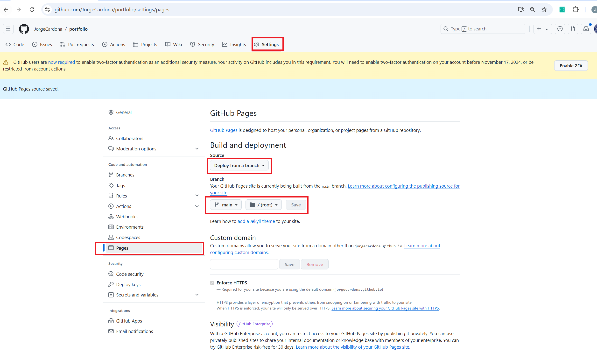

# Portfolio

A **scaffolding** of a React project designed to deploy and maintain a website hosted on GitHub Pages provides a structured starting point for development. This setup typically includes a basic React application generated using `create-react-app`, essential dependencies for routing and deployment (such as `react-router-dom` and `gh-pages`), and configuration files like `package.json` that define scripts for building and deploying the application. The scaffolding ensures that developers can quickly start building their web application while having the necessary tools and configurations in place to facilitate deployment to GitHub Pages, allowing for easy hosting and management of the site.

## 1. Create the Project
```bash
npx create-react-app portfolio
```
This command uses `npx` to execute `create-react-app`, a tool that simplifies the process of creating React applications. The project name is `portfolio`, and this command will automatically generate the necessary folder and file structure to start developing a React application.

## 2. Navigate to the Project
```bash
cd portfolio
```
This command changes the current working directory to the newly created project folder called `portfolio`. This is essential to run commands related to your application within its context.

## 3. Install Dependencies
### a. React Router
```bash
npm install react-router-dom
```
`react-router-dom` is a library that enables routing in React applications. It allows you to create routes within your application, facilitating navigation between different components (pages). This is necessary for applications that have multiple views.

### b. GitHub Pages
```bash
npm install gh-pages --save-dev
```
This command installs `gh-pages`, a tool that simplifies the deployment of applications to GitHub Pages. By adding `--save-dev`, the dependency is installed as a development dependency, meaning it is only required during development and not in production.

### Set up GitHub Pages deployment


## 4. Configure package.json
Ensure that your `package.json` file has the following structure at the beginning:
```json
{
  "name": "portfolio",
  "version": "0.1.0",
  "private": true,
  "homepage": "https://JorgeCardona.github.io/portfolio",
  "dependencies": {
    "@testing-library/jest-dom": "^5.17.0",
    "@testing-library/react": "^13.4.0",
    "@testing-library/user-event": "^13.5.0",
    "react": "^18.3.1",
    "react-dom": "^18.3.1",
    "react-router-dom": "^6.27.0",
    "react-scripts": "5.0.1",
    "web-vitals": "^2.1.4"
  },
  "scripts": {
    "start": "react-scripts start",
    "build": "react-scripts build",
    "test": "react-scripts test",
    "eject": "react-scripts eject",
    "predeploy": "npm run build",
    "deploy": "gh-pages -d build"
  },
  "eslintConfig": {
    "extends": [
      "react-app",
      "react-app/jest"
    ]
  },
  "browserslist": {
    "production": [
      ">0.2%",
      "not dead",
      "not op_mini all"
    ],
    "development": [
      "last 1 chrome version",
      "last 1 firefox version",
      "last 1 safari version"
    ]
  },
  "devDependencies": {
    "gh-pages": "^6.2.0"
  }
}
```
- **name**: Defines the name of your project.
- **version**: Specifies the current version of your application.
- **private**: When set to `true`, it prevents the package from being accidentally published to the npm registry.
- **homepage**: Sets the homepage URL for your application, necessary for deployment on GitHub Pages.
- **dependencies**: Lists the dependencies necessary for your application to function.
- **scripts**: Defines custom commands for common tasks, such as starting, building, and deploying your application.
  - **start**: Starts the development server.
  - **build**: Compiles the application for production.
  - **test**: Runs tests on the application.
  - **eject**: Exposes the configuration of the project (useful if you need to customize the setup).
  - **predeploy**: Compiles the application before deploying it.
  - **deploy**: Runs commands to set the homepage and deploys the application to GitHub Pages.
- **eslintConfig**: Configuration for ESLint, ensuring that the recommended style for React applications is followed.
- **browserslist**: Defines which browsers should be supported in production and development.
- **devDependencies**: Includes development dependencies such as `gh-pages`, which is used for deployment.

## 5. Configure GitHub Pages Deployment with Push to Main
```bash
git push origin main
```

This command triggers the deploy script, which updates the homepage URL in package.json and uses the gh-pages package to deploy the built application to the gh-pages branch of your GitHub repository. This deployment step is essential for making your application accessible online via GitHub Pages.

## 6. Deploy the Application to GitHub Pages using the npm Command
```bash
npm run deploy
```

This command executes the deploy script, which updates the homepage URL in package.json and utilizes the gh-pages package to deploy the compiled application to the gh-pages branch of your GitHub repository. This process is crucial for making your application publicly available online through GitHub Pages.

## 7. Verify the Application on GitHub Pages
You can access the deployed application at the following URL:
[https://JorgeCardona.github.io/portfolio](https://JorgeCardona.github.io/portfolio)

Visit this URL in your browser to ensure that the application has been deployed correctly and is functioning as expected. It is important to check that all links and resources load without issues.

# Steps to Download the Repository, Install Dependencies, and Run the Project Locally

## 8. **Clone the Repository**  
   Download the repository from GitHub using the following command:  
   ```bash
   git clone https://github.com/JorgeCardona/portfolio.git
   ```

## 9. **Navigate to the Project Directory**  
   Change into the project directory:  
   ```bash
   portfolio
   ```

## 10. **Install Project Dependencies**  
   Install all necessary dependencies defined in the `package.json` file:  
   ```bash
   npm install
   ```

## 11. **Run the Development Server**  
   Start the local development server to view the application in your browser:  
   ```bash
   npm start
   ```

## 12. **Access the Application**  
   Open your web browser and go to `http://localhost:3000` to view the running application locally.

## 13. **Make Changes and See Live Updates**  
   As you make changes to the source code, the application will automatically reload in the browser, allowing you to see updates in real time.

## 14. **Stop the Development Server**  
   To stop the server, return to the terminal where it's running and press `Ctrl + C`. This will terminate the local server.